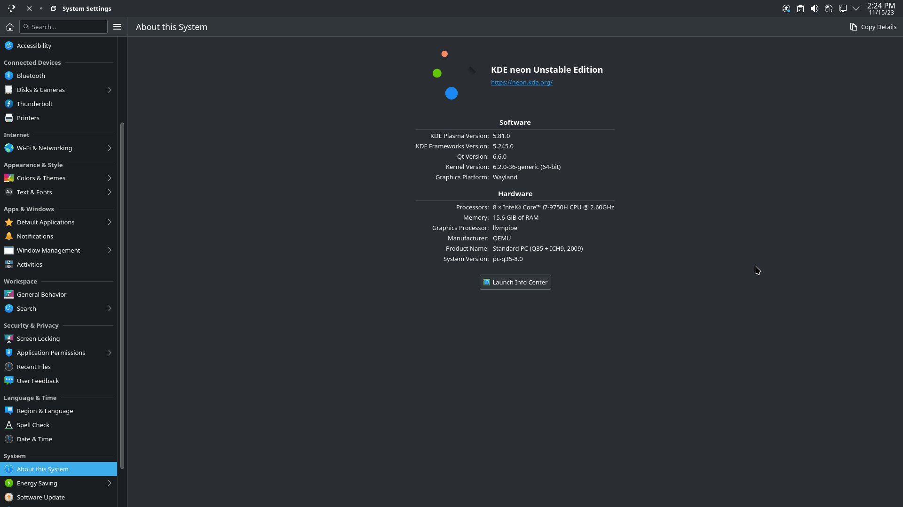

# Simple window buttons plasmoid (WIP)

Simple QML only alternative for psifidotos Window buttons widget

## Screenshots


<details>
    <summary>More</summary>

Maximized window


</details>

## Requirements

* Plasma 6

## Current & planned features

* [x] Close, minimize, Maximize/Restore buttons on maximized windowss
* [ ] TODO

## Installing

### Manual install

* Install dependencies (please let me know if I missed or added something unnecessary)

  ```txt
    cmake extra-cmake-modules plasma-framework
  ```

* Install the plasmoid

  ```sh
  ./install.sh
  ```

## Credits

* [Window buttons by @psifidotos](https://github.com/psifidotos/applet-window-buttons)
* [@paulmcauley](https://github.com/paulmcauley/klassy-icons) for the klassy icons
